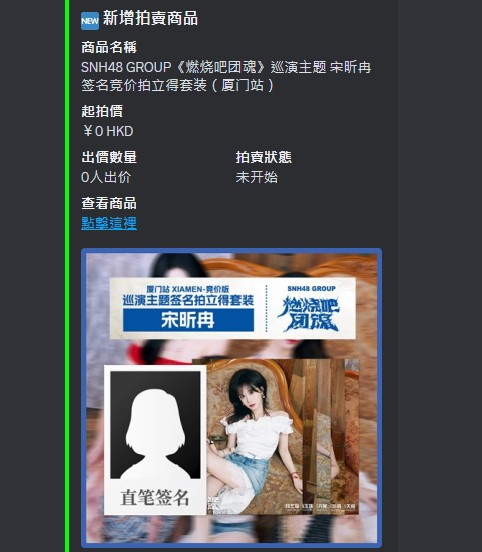
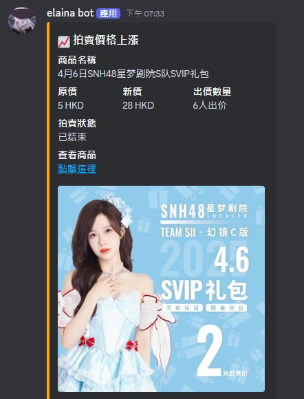
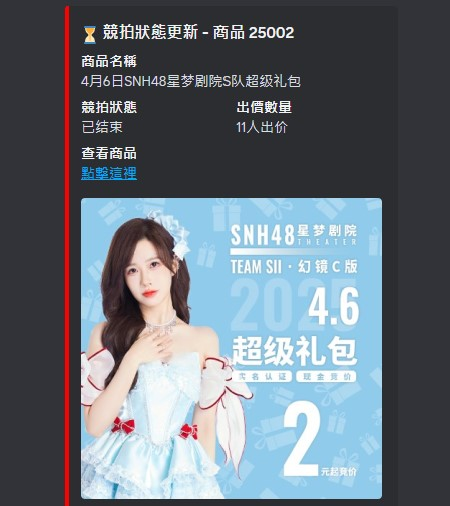

# SNH48 Auction Watcher

*snh48-auction-monitor** is an automated auction data monitoring tool designed to track and monitor product changes on SNH48 offical shopping auction platform. The program fetches data every 5 minutes by default, but users can adjust the interval as needed.


## Installation

1. Ensure you have Python 3.6 or later installed.
2. Clone the repository:
    ```bash
    git clone https://github.com/koyuki-chan/snh48-auction-watcher.git
    cd snh48-auction-watcher
    ```
3. Install the required Python packages:
    ```bash
    pip install -r requirements.txt
    ```

## Configuration

### 1. Set up Discord Bot

- Create an application on the Discord Developer portal and get your bot token.
- Rename `.env.example` to `.env` and fill your discord bot token and the channel ID you want send
### 2. Log File  
- You can set the log files saving path by editing `config.json`

## Usage
1. Open cmd and cd to this project folder.
2. Run the scraper and start monitoring auction data:
    ```bash
    python main.py
    ```

## Examples
Here are examples of the notifications sent by the bot when there are updates to the auction:

### 1. New Product Notification
This notification is sent when a new product is listend in the auction:


### 2. Price Increase Notification
This notification is sent when a product's price increases:


### 3. Auction Ended Notification
This notification is sent when an auction for a product has ended:



## License

This project is licensed under the [MIT License](LICENSE).
